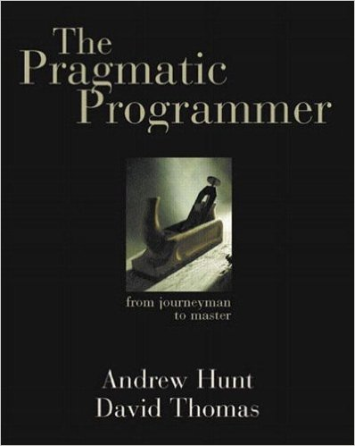

- title : Why we love and use F#
- description : Why you should learn F#
- author : Branimir Momčilović
- theme : night
- transition : default

***
<!-- <p style="text-align:left">
    
</p> -->

##  Why we love and use F#
<br />
<br />
<br />
<br />
Branimir Momčilović  
branimir.momcilovic@gmail.com  
[azbooky software](https://azbooky.com/)  

' Dolazim iz azbooky software, Beogradske softverske kuće. 2015 godine smo se okupili sa ciljem da razvijemo softversko rešenje za Američku Limo industriju. Što nam je i uspelo, naš dispatching sistem koristi jedan od najvećih prevoznika u NY, na istočnoj obali. Od početka smo koristi F# za gotovo sav backend razvoj, u početku sa idejom da ubrzamo razvoj PoC rešenja, ali nam se toliko svideo da smo i na dalje nastavili da koristimo F# i sve i više uključujemo tooling F# zajednice u naše projekte. Imamo dva veća projekta napisana u F#, dispatching i pripadajući servisi su na .NET framework-u 4.7 i rade na windows OS, a drugi projekat je deo za prihvatanje bukinga i on je .NET core, i radi na linuxu, tj. u dokeru.

***

### Agenda

* Motivation: Should I learn a new programming language?
* Why F#
 * It's a part of .NET Core
 * The tooling capabilities (IDE integration)
 * The language itself is amazing
 * Community (samples, 3rd-party libraries)
* Questions?

' Pokušaću da prenesem utiske posle više od 4 godina korišćenja F# u našem timu. Pre svega na neku svakodnevnu upotrebu u jednom u početku start up okruženju, sa ne najbolje definisanim zahtevima i kratkim budžetom, a kasnije i onboardingom novih ljudi i održavanjem softvera koji je već nekoliko godina u produkciji. Bilo bi još bolje da su tu kolege iz azbookija sa mnom, pre svega Dragan Jovanović, koji je aktivan i u OS zajednici i svakako bolji F# programer od mene.
' Ova prezentacija je nastala iz malog internog treninga za nove kolege i neobaveznih razgovora o tome koliko sam programski jezik utiče na razvoj softvera i način na koji razmišljamo, tj. u našem slučaju možda preciznije način na koji modelujemo biznis procese. Znači nema visoke matematike, ni nekih preterano naprednih tehnika funkcionalnog programiranja, iz jednostavnog razloga što ih ja nisam dovoljno savladao da bih o njima govorio :)

***

### Why I should learn a new programming language?



*From The Pragmatic Programmer, Tip #8*  

"Invest Regularly in Your Knowledge Portfolio":  
<br />    
Learn at least one new language every year. 

' Different languages solve the same problems in different ways.
' By learning several different approaches, you can help broaden your thinking and avoid getting stuck in a rut.
' Additionally, learning many languages is far easier now, thanks to the wealth of freely available software on the Internet.  

' The Pragmatic Programmer, From Journeyman to Master by Andrew Hunt and David Thomas 1999
' Ideas: Care About Your Craft, Don’t Live with Broken Windows, Use Tracer Bullets to Find the Target, Orthogonality

' https://en.wikipedia.org/wiki/Turing_completeness https://en.wikipedia.org/wiki/Lambda_calculus
' In computability theory, a system of data-manipulation rules is said to be Turing complete or computationally universal if it can be used to simulate any Turing machine. A classic example is lambda calculus. A closely related concept is that of Turing equivalence – two computers P and Q are called equivalent if P can simulate Q and Q can simulate P.

---

### Importance of Language


Here are seven random numbers. Sort of like a telephone number, but arranged vertically. Take a glance — just a glance — then pause, take out a piece of paper and see how many you can recall.

Done?

---

### Asian children find it easier to learn to count than Europeans

According to the French neurologist and mathematician Stanislas Dehaene, about 50 percent of English speakers can remember all seven numbers.  

Experiments have repeatedly shown that Asian children find it easier to learn to count than Europeans. A regular system (of number-words) also makes arithmetic clearer to understand.

* [China's Numbers Are Shorter Than Ours by Robert Krulwich](https://www.npr.org/sections/krulwich/2011/07/01/137527742/china-s-unnatural-math-advantage-their-words)

' If, however, you are a Chinese speaker, you tend to do much better. The average Chinese speaker can memorize nine numbers in this same amount of time.  
' In one study with Chinese and American 4- and 5-year-olds, the two nationalities performed similarly when learning to count to 12, but the Chinese were about a year ahead with higher numbers.

---

### Why The Difference?

The difference, says Dehaene, is how the words sound in your head. The Chinese words for the first nine numbers are all short, concise and bullet-like: "yi," "er," "san," "si," "wu," "liu," "qi," "ba," "jiu." He timed them and they average about a quarter of a second each.  

In English we start with "one", "two", but "three" can stretch out a bit and "seven" is a real slower-downer, being two syllables long, so the English number-words take a little longer, a third of a second each.

[Chinese (Mandarin) - Numbers (1-10)](
https://l-lingo.com/free-lessons/en/learn-chinese-mandarin/numbers-1-10.html)

---

### Learn, learn and learn

' Language shapes your way of thinking.
' The hypothesis of linguistic relativity holds that the structure of a language affects its speakers' world view or cognition.

***

### What is F#


F# is a functional first programming language that makes it easy to write correct and maintainable code.  
<br /><br />  

* 2002: F# language design started <br />
  (Developed by Microsoft Research, Don Syme and his team, F is for "Fun")
* 2017: .NET Core includes F# support by default

' Većina nas koristi više različitih programskih jezika svakodnevno. Klasifikacije ima puno, od onih tradicionalnih na low level i high levele jezike, pa nadalje. Neki su slični, razlike su u sintaksi, nekim featurim-a, na primer C# i Java, a neki se razlikuju po paradigmi, C# Object Oriented, SQL je deklarativan. C se kompajlira, JavaScript interpretira. Svaki od ovih pristupa ima neke svoje prednosti i mane, ja sam u F#-u našao, možda i idealan alat, koji rešava neke klasične probleme, kao što su TypeSafe, Null exceptions,

' The language was originally designed and implemented by Don Syme, according to whom in the fsharp team, they say the F is for "Fun".
' F# is a functional first programming language that makes it easy to write correct and maintainable code.

' F# programming primarily involves defining types and functions that are type-inferred and generalized automatically. This allows your focus to remain on the problem domain and manipulating its data, rather than the details of programming.

---

### Why use F#

 * It's a part of .NET Core
 * The tooling capabilities
 * The language itself is amazing
 * The F# community is great!

---

### 1. .NET Core SDK includes the F#


' [Download .NET Core SDK](https://www.microsoft.com/net/download)
' * Cross-platform
' * Consistent across architecures
' * Command-line tools
' * Flexible deployment
' * Open source
' * Supported by Microsoft

' https://docs.microsoft.com/en-us/dotnet/core/about
' .NET Core is a cross-platform version of .NET for building websites, services, and console apps.

***

### 2. Tooling

* [VS Code](https://code.visualstudio.com/) + [Ionide](http://ionide.io/)
* Visual Studio
* Visual Studio for Mac
* JetBrains Rider

' Ionide includes all the necessary features you’d find in a modern IDE - autocomplete, tooltips, document formatting, syntax and error highlighting, and many more.

---


' F# Compiler Services
' The F# compiler services package is a component derived from the F# compiler source code that exposes additional functionality for implementing F# language bindings, additional tools based on the compiler or refactoring tools. The package also includes F# interactive service that can be used for embedding F# scripting into your applications.

***

### 3. The language itself is amazing


---

### Demo

* Conciseness
* Completness
* Composition
* Correctness

' F# is not cluttered up with coding “noise” such as curly brackets.
' Many common programming tasks are much simpler in F#  
' F# has a powerful type system which prevents many common errors such as null reference exceptions.  
' Asynchronous programming is very easy, as is parallelism.
' F# is designed as a hybrid functional/OO language, so it can do virtually everything that C# can do.
' F# is not cluttered up with coding “noise” such as curly brackets, semicolons and so on. You almost never have to specify the type of an object, thanks to a powerful type inference system. And, compared with C#, it generally takes fewer lines of code to solve the same problem.
' Many common programming tasks are much simpler in F#. This includes things like creating and using complex type definitions, doing list processing, comparison and equality, state machines, and much more. Add because functions are first class objects, it is very easy to create powerful and reusable code by creating functions that have other functions as parameters, or that combine existing functions to create new functionality.
' F# has a number of built-in libraries to help when more than one thing at a time is happening. Asynchronous programming is very easy, as is parallelism. F# also has a built-in actor model, and excellent support for event handling and functional reactive programming. And of course, because data structures are immutable by default, sharing state and avoiding locks is much easier.

---

### Conciseness

```
> 1 + 5;;
val it : int = 6
```

```
> let square x = x * x;;
val square : x:int -> int
```

```
> [1..100] |> List.sum |> printfn "sum=%d";;
sum=5050
val it : unit = ()
```

```
type Person =
    { First:string
      Last:string }
```
---

### Completness

* dotnet new console -lang F#


' Although it is a functional language at heart, F# does support other styles which are not 100% pure, which makes it much easier to interact with the non-pure world of web sites, databases, other applications, and so on. In particular, F# is designed as a hybrid functional/OO language, so it can do virtually everything that C# can do. Of course, F# is part of the .NET ecosystem, which gives you seamless access to all the third party .NET libraries and tools. It runs on most platforms, including Linux and smart phones (via Mono). Finally, it is well integrated with Visual Studio, which means you get a great IDE with IntelliSense support, a debugger, and many plug-ins for unit tests, source control, and other development tasks. Or on Linux, you can use the MonoDevelop IDE instead.

---

#### Classes, imutability

```
let mutable counter = 0
counter <- 4
```

```
type IEnumerator<'a> =
    abstract member Current : 'a
    abstract MoveNext : unit -> bool
```

```
// extension methods
type System.Int32 with
    member this.IsEven = this % 2 = 0

(2).IsEven
```

---

### Composition

```
let getFolderSize =
    filesUnderFolder
    >> Seq.map (fileInfo >> fileSize)
    >> Seq.sum
    >> bytesToMB
```

---

### Correctness

* Non-null types/classes
* Immutable
* Type system, strict and expressive

' Immutability, which enables code to behave much more predictably.
' Exhaustive pattern matching, which traps many common errors at compile time.
' A strict type system, which is your friend, not your enemy. You can use the static type checking almost as an instant “compile time unit test”.
' An expressive type system that can help you “make illegal states unrepresentable”* . We’ll see how to design a real-world example that demonstrates this.
' F# has a powerful type system which prevents many common errors such as null reference exceptions. Values are immutable by default, which prevents a large class of errors. In addition, you can often encode business logic using the type system itself in such a way that it is actually impossible to write incorrect code or mix up units of measure, greatly reducing the need for unit tests.

---

#### Option type

```
type Option<'a> =       // use a generic definition
   | Some of 'a         // valid value
   | None               // missing

```

```
match o1 with
| Some value ->
    printfn "%d" value
| None ->
    printfn "No value"
```

---

#### Domain modeling

```
type PaymentMethod =
  | Cash
  | Cheque of int
  | Card of CardType * CardNumber

```

```
match paymentMethod with
| Cash ->
    printfn "Paid in cash"
| Cheque checkNo ->
    printfn "Paid by cheque: %i" checkNo
| Card (cardType,cardNo) ->
    printfn "Paid with %A %A" cardType cardNo
```

***

### 4. The F# community is great

#### Where to start
* [F# Software Foundation](https://fsharp.org/)
* [F# for fun and profit by Scott Wlaschin](https://fsharpforfunandprofit.com/)
* [F# style guide](http://aka.ms/fsharpstyleguide)

---

#### Projects
* [FAKE](https://fake.build/) - F# Make
' A DSL FOR BUILD TASKS AND MORE
* [Paket](https://fsprojects.github.io/Paket/)
' Paket is a dependency manager for .NET and mono projects, which is designed to work well with NuGet packages and also enables referencing files directly from Git repositories or any HTTP resource. It enables precise and predictable control over what packages the projects within your application reference.
* [Fable](http://fable.io/)
' Fable is an F# to JavaScript compiler powered by Babel, designed to produce readable and standard code.
* [Giraffe](https://github.com/giraffe-fsharp/Giraffe)
' A functional ASP.NET Core micro web framework for building rich web applications.
* [SAFE stack](https://safe-stack.github.io/)
' SAFE is an application development stack that brings several technologies together into a single, coherent stack for type-safe, flexible, web-enabled applications that can be written almost entirely in F#.
* [Ionide](http://ionide.io/)
' A Visual Studio Code package suite for cross platform F# development.
* [FsReveal](http://fsprojects.github.io/FsReveal/)
' FsReveal allows you to write beautiful slides in Markdown and brings C# and F# to the reveal.js web presentation framework.

***

### Thanks to
* [F# for fun and profit by Scott Wlaschin](https://fsharpforfunandprofit.com/)
* [F# Software Foundation](https://fsharp.org)  
* [How to (and not to) give a talk on F# by Ted Neward](http://blogs.tedneward.com/post/how-to-and-not-to-give-a-talk-on-f/)

' Thanks these guys for inspiring us

---

***

### Checklist
* It's a good idea to learn a new programming language
* F# is a great choice  
<br />
* We haven't mentioned: Type providers, RoP, Computation Expressions, etc.


' The F# core library defines three built-in computation expressions: Sequence Expressions, Asynchronous Workflows, and Query Expressions.

---

### Thank you!

* Questions?  
<br />  
https://azbooky.com  <br/>
http://bug.rs  <br/>
Thank you again